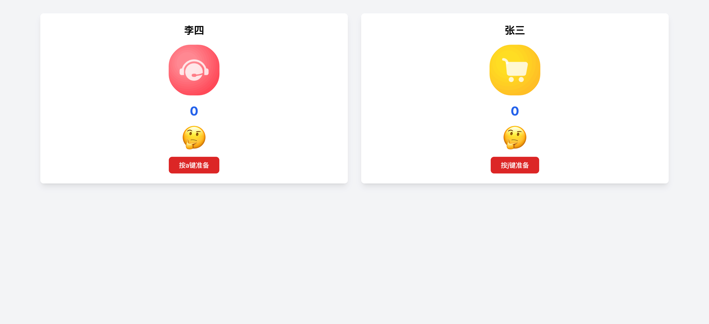
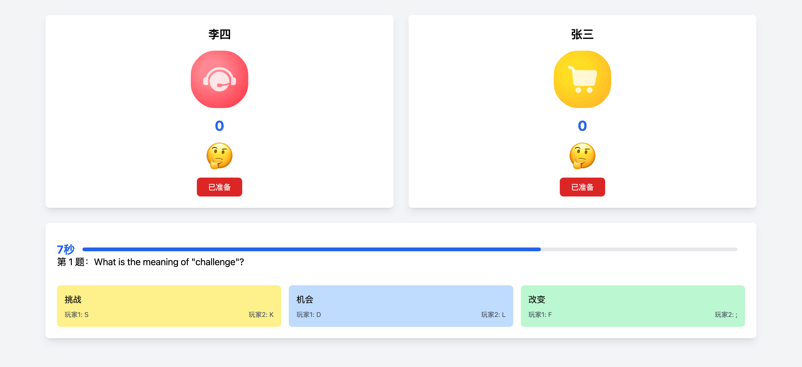
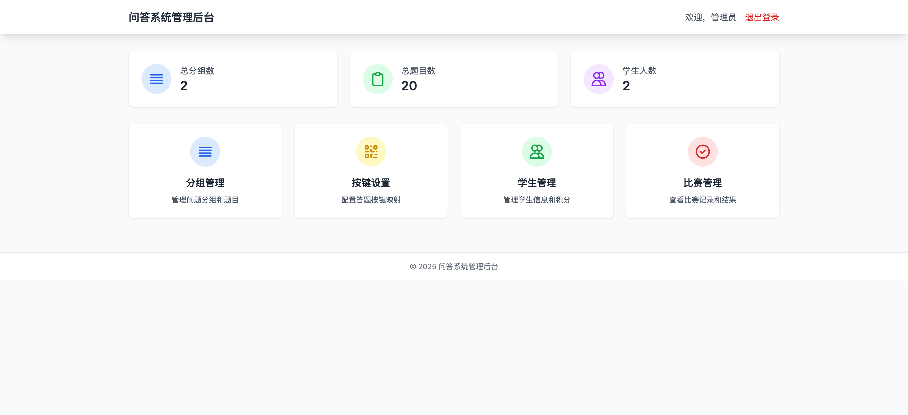

# QuestionGame

一个基于 PHP 开发的本地会议单词问答游戏系统，专门设计用于帮助孩子们学习和记忆单词。

## 功能特点

- 支持 2 个选手同时参与
- 专用按键快速响应
- 实时积分统计
- 题目难度分级
- 适合会议室使用的大屏显示界面

## 硬件要求

- 电脑一台（运行服务器）
- 显示器或投影仪（显示题目）
- 8个专用按键（3个选手抢答设备 + 1个准备按键）*2

## 按键配置

专用按键对应关系：
- 红色按键：准备按钮
- 黄色按键：A
- 蓝色按键：B
- 绿色按键：C

## 环境要求

- PHP >= 7.0
- SQLite3
- Apache/Nginx

## 系统截图

### 开始页面


### 比赛开始


### 比赛中



### 管理界面


## 快速开始

### 安装

1. 克隆项目到本地
```bash
git clone https://github.com/lixingxing1996/questionGame.git
```

2. 初始化数据库和测试数据
```bash
php init_db.php
php test.php
```

### 启动服务

```bash
php -S localhost:8000
```

访问 http://localhost:8000 即可使用系统

### 使用说明

1. 将系统连接到大屏幕或投影仪
2. 确保所有专用按键正确连接
3. 主持人使用红色按键控制题目准备
4. 选手使用对应颜色按键选择答案
5. 系统自动记录得分情况

## 注意事项

- 使用前请测试所有按键是否正常工作
- 建议准备备用按键设备
- 确保显示屏幕足够大，所有选手都能清楚看到题目
- 建议在使用前进行完整的设备测试
- 检查按键颜色与系统设置是否对应

## 联系方式

- 邮箱：admin@xingxings.cn
- 微信：coderedu
- 博客：[丁香花](http://www.xingxings.cn)

## License

MIT License

Copyright (c) 2024 星星 